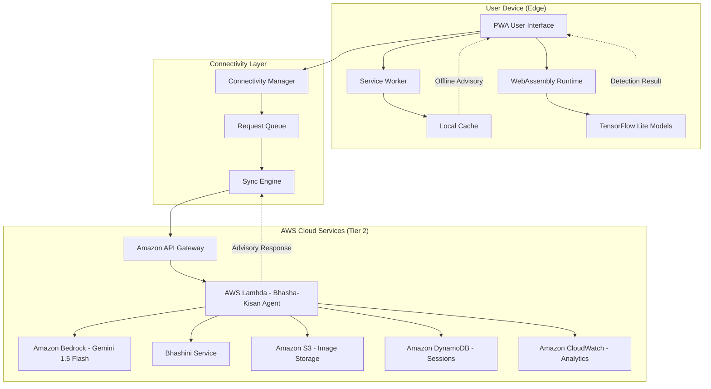

# Design Document: Krishi-Kavach AI

## Overview

Krishi-Kavach AI implements a novel hybrid-compute architecture that bridges the digital divide in rural India through a two-tiered intelligence system. The design prioritizes offline-first functionality while seamlessly integrating cloud-based AI advisory when connectivity permits.

### Architecture Philosophy

The system follows a "graceful degradation" principle where core functionality (disease detection) works entirely offline, while enhanced features (detailed advisory, multilingual support) activate progressively as network connectivity improves. This ensures farmers always have access to critical diagnostic capabilities regardless of infrastructure limitations.

### Key Design Decisions

1. **WebAssembly for Edge Computing**: Chosen over native mobile apps to enable cross-platform deployment through Progressive Web App architecture, reducing development complexity and storage requirements.

2. **TensorFlow Lite Models**: Selected for their optimization for mobile/edge devices, small model size (< 10MB), and proven performance on low-end hardware.

3. **Gemini 1.5 Flash via Amazon Bedrock**: Chosen for its multimodal capabilities (image + video + text), cost-effectiveness, and fast inference times suitable for 2G/3G networks. Accessed through Amazon Bedrock for seamless AWS integration.

4. **Bhashini Integration**: Government-backed service ensuring long-term sustainability and comprehensive coverage of Indian languages and dialects.

5. **Progressive Web App**: Eliminates app store friction, reduces storage footprint, and enables instant updates without user intervention.

6. **AWS Serverless Architecture**: Leverages AWS Lambda for compute, Amazon S3 for storage, Amazon API Gateway for API management, and Amazon DynamoDB for session management, ensuring scalability and cost-efficiency.

## Architecture

### System Architecture Diagram



### Tiered Intelligence System

**Tier 1 - Edge/Offline (Digital Vaidya)**
- Runs entirely on device using WebAssembly
- TensorFlow Lite models for disease detection
- No network dependency
- Response time: < 3 seconds
- Memory footprint: < 100MB
- Handles: Lumpy Skin Disease detection, crop pest identification

**Tier 2 - Cloud/Agentic (Bhasha-Kisan)**
- Activates when network available (even 2G)
- Gemini 1.5 Flash via Amazon Bedrock for multimodal analysis
- AWS Lambda for serverless compute
- Amazon S3 for image/video storage
- Amazon DynamoDB for session management
- Bhashini for multilingual support
- Response time: < 10 seconds (2G), < 5 seconds (4G)
- Handles: Detailed advisory, treatment recommendations, contextual guidance

### Data Flow

**Offline Detection Flow:**
1. User captures image via PWA camera interface
2. Image preprocessed (resize, normalize) in browser
3. WebAssembly runtime loads TFLite model from cache
4. Inference performed locally
5. Detection result displayed immediately
6. Result cached locally for history

**Online Advisory Flow:**
1. User requests detailed advice (or automatic trigger after detection)
2. Connectivity Manager checks network state
3. If online: multimodal input (image/video/voice) prepared
4. Data compressed and encrypted
5. Sent to Amazon API Gateway with user context
6. AWS Lambda (Bhasha-Kisan Agent) processes request
7. Lambda invokes Gemini 1.5 Flash via Amazon Bedrock for analysis
8. Lambda stores images/videos in Amazon S3
9. Lambda saves session context in Amazon DynamoDB
10. Response translated via Bhashini to user's dialect
11. Advisory delivered and cached locally
12. If offline: request queued for later sync

## Components and Interfaces

### 1. Progressive Web App (PWA) Shell

**Responsibilities:**
- Provide installable web application
- Manage service worker lifecycle
- Handle offline/online transitions
- Coordinate UI rendering

**Key Technologies:**
- HTML5, CSS3, JavaScript (ES2020+)
- Service Worker API
- Cache API
- IndexedDB for local storage

**Interface:**
```typescript
interface PWAShell {
  initialize(): Promise<void>;
  registerServiceWorker(): Promise<ServiceWorkerRegistration>;
  checkForUpdates(): Promise<boolean>;
  installPrompt(): Promise<boolean>;
}
```

### 2. WebAssembly Edge Module

**Responsibilities:**
- Load and execute TensorFlow Lite models
- Perform image preprocessing
- Run inference on device
- Return detection results

**Key Technologies:**
- WebAssembly (Wasm)
- TensorFlow Lite for Web
- WASM SIMD for acceleration
- Web Workers for non-blocking execution

**Interface:**
```typescript
interface EdgeModule {
  loadModel(modelPath: string): Promise<void>;
  preprocessImage(imageData: ImageData): Float32Array;
  detectDisease(imageData: ImageData): Promise<DetectionResult>;
  detectPest(imageData: ImageData): Promise<DetectionResult>;
  getModelVersion(): string;
  unloadModel(): void;
}

interface DetectionResult {
  diseaseType: string;
  confidence: number;
  severity?: 'mild' | 'moderate' | 'severe';
  affectedAreas?: BoundingBox[];
  timestamp: number;
  modelVersion: string;
}

interface BoundingBox {
  x: number;
  y: number;
  width: number;
  height: number;
  label: string;
}
```

### 3. Connectivity Manager

**Responsibilities:**
- Monitor network state changes
- Determine connection quality (offline, 2G, 3G, 4G, WiFi)
- Enable/disable cloud features based on connectivity
- Manage request queuing for offline scenarios

**Interface:**
```typescript
interface ConnectivityManager {
  getCurrentState(): ConnectivityState;
  onStateChange(callback: (state: ConnectivityState) => void): void;
  estimateBandwidth(): Promise<number>; // kbps
  isCloudAvailable(): boolean;
  queueRequest(request: CloudRequest): void;
  processQueue(): Promise<void>;
}

enum ConnectivityState {
  OFFLINE = 'offline',
  SLOW_2G = '2g',
  FAST_3G = '3g',
  FAST_4G = '4g',
  WIFI = 'wifi'
}

interface CloudRequest {
  id: string;
  type: 'advisory' | 'sync' | 'update';
  payload: any;
  priority: number;
  timestamp: number;
}
```

### 4. Bhasha-Kisan Agent Module (AWS Lambda)

**Responsibilities:**
- Orchestrate multimodal AI analysis
- Integrate with Gemini 1.5 Flash via Amazon Bedrock
- Coordinate with Bhashini for translation
- Generate contextual agricultural advisory
- Maintain conversation context in Amazon DynamoDB
- Store media files in Amazon S3

**Key Technologies:**
- AWS Lambda (Python 3.11 runtime)
- Amazon Bedrock (Gemini 1.5 Flash model)
- Bhashini API
- Amazon S3 for media storage
- Amazon DynamoDB for session management
- Amazon CloudWatch for logging and monitoring

**Interface:**
```typescript
interface BhashaKisanAgent {
  analyzeMultimodal(input: MultimodalInput, context: FarmContext): Promise<AdvisoryResponse>;
  translateToDialect(text: string, dialect: string): Promise<string>;
  textToSpeech(text: string, dialect: string): Promise<AudioBuffer>;
  speechToText(audio: AudioBuffer, language: string): Promise<string>;
  maintainContext(sessionId: string, message: string): void;
}

interface MultimodalInput {
  images?: ImageData[];
  video?: VideoData;
  voice?: AudioBuffer;
  text?: string;
  detectionResult?: DetectionResult;
}

interface FarmContext {
  userId: string;
  location: {
    state: string;
    district: string;
    coordinates?: [number, number];
  };
  crops: string[];
  livestock: string[];
  season: string;
  language: string;
  dialect: string;
}

interface AdvisoryResponse {
  diagnosis: string;
  confidence: number;
  treatment: TreatmentPlan;
  prevention: string[];
  resources: Resource[];
  reasoning: string;
  language: string;
  audioUrl?: string;
}

interface TreatmentPlan {
  immediate: string[];
  shortTerm: string[];
  longTerm: string[];
  estimatedCost?: number;
  localAvailability: boolean;
}

interface Resource {
  type: 'product' | 'service' | 'information';
  name: string;
  description: string;
  availability: string;
  cost?: number;
}
```

### 5. Model Management Service (AWS Lambda + S3)

**Responsibilities:**
- Serve TensorFlow Lite models from Amazon S3
- Handle model versioning
- Provide incremental updates
- Track model performance metrics in Amazon CloudWatch

**Key Technologies:**
- AWS Lambda for API endpoints
- Amazon S3 for model storage
- Amazon CloudFront for CDN distribution
- Amazon DynamoDB for version tracking

**Interface:**
```typescript
interface ModelManagementService {
  checkForUpdates(currentVersion: string): Promise<ModelUpdate | null>;
  downloadModel(modelId: string, version: string): Promise<ArrayBuffer>;
  validateModel(modelData: ArrayBuffer): Promise<boolean>;
  reportPerformance(metrics: ModelMetrics): Promise<void>;
}

interface ModelUpdate {
  modelId: string;
  version: string;
  size: number;
  changelog: string;
  downloadUrl: string;
  checksum: string;
}

interface ModelMetrics {
  modelVersion: string;
  averageInferenceTime: number;
  accuracyFeedback: number;
  deviceInfo: string;
  timestamp: number;
}
```

### 6. Local Cache Manager

**Responsibilities:**
- Store detection results locally
- Cache advisory responses
- Manage offline content
- Implement LRU eviction policy

**Interface:**
```typescript
interface CacheManager {
  storeDetection(result: DetectionResult): Promise<void>;
  storeAdvisory(advisory: AdvisoryResponse, key: string): Promise<void>;
  getAdvisory(key: string): Promise<AdvisoryResponse | null>;
  getHistory(limit: number): Promise<DetectionResult[]>;
  clearOldEntries(maxAge: number): Promise<void>;
  getStorageUsage(): Promise<StorageInfo>;
}

interface StorageInfo {
  used: number; // bytes
  available: number; // bytes
  itemCount: number;
}
```

### 7. Bhashini Integration Service

**Responsibilities:**
- Interface with Bhashini API
- Handle language detection
- Manage translation requests
- Provide speech synthesis and recognition

**Key Technologies:**
- Bhashini REST API
- Audio encoding/decoding (WebM, MP3)

**Interface:**
```typescript
interface BhashiniService {
  detectLanguage(text: string): Promise<string>;
  translate(text: string, sourceLang: string, targetLang: string, dialect?: string): Promise<string>;
  synthesizeSpeech(text: string, language: string, dialect?: string): Promise<AudioBuffer>;
  recognizeSpeech(audio: AudioBuffer, language: string): Promise<string>;
  getSupportedLanguages(): Promise<LanguageInfo[]>;
}

interface LanguageInfo {
  code: string;
  name: string;
  dialects: string[];
  ttsSupported: boolean;
  sttSupported: boolean;
}
```

### 8. User Interface Components

**Responsibilities:**
- Camera capture interface
- Detection result visualization
- Advisory display with audio playback
- Voice command interface
- Settings and profile management

**Key Components:**
- CameraCapture: Large button interface for image/video capture
- ResultDisplay: Visual indicators with color coding and icons
- AdvisoryViewer: Text + audio + visual diagrams
- VoiceInterface: Voice command recognition and feedback
- ProfileManager: Farm context and language preferences

**Interface:**
```typescript
interface UIComponents {
  camera: CameraCapture;
  results: ResultDisplay;
  advisory: AdvisoryViewer;
  voice: VoiceInterface;
  profile: ProfileManager;
}

interface CameraCapture {
  captureImage(): Promise<ImageData>;
  captureVideo(duration: number): Promise<VideoData>;
  switchCamera(): void;
  enableFlash(enabled: boolean): void;
}

interface ResultDisplay {
  showDetection(result: DetectionResult): void;
  showLoading(): void;
  showError(message: string): void;
  highlightAreas(boxes: BoundingBox[]): void;
}

interface AdvisoryViewer {
  displayAdvisory(advisory: AdvisoryResponse): void;
  playAudio(audioUrl: string): Promise<void>;
  showDiagrams(diagrams: string[]): void;
  enableTextToSpeech(enabled: boolean): void;
}

interface VoiceInterface {
  startListening(): Promise<void>;
  stopListening(): Promise<string>;
  speak(text: string): Promise<void>;
  registerCommand(command: string, handler: () => void): void;
}

interface ProfileManager {
  updateFarmContext(context: Partial<FarmContext>): Promise<void>;
  getFarmContext(): Promise<FarmContext>;
  setLanguagePreference(language: string, dialect: string): Promise<void>;
  exportData(): Promise<Blob>;
  importData(data: Blob): Promise<void>;
}
```

## Data Models

### Detection Result Model

```typescript
interface DetectionResult {
  id: string;
  timestamp: number;
  imageData: string; // base64 encoded
  detectionType: 'lumpy_skin_disease' | 'crop_pest' | 'general';
  
  // Primary detection
  diseaseType: string;
  confidence: number;
  severity?: 'mild' | 'moderate' | 'severe';
  
  // Spatial information
  affectedAreas?: BoundingBox[];
  lesionCount?: number;
  
  // Model metadata
  modelVersion: string;
  inferenceTime: number; // milliseconds
  
  // User feedback
  userFeedback?: {
    accurate: boolean;
    correctedLabel?: string;
    notes?: string;
  };
  
  // Sync status
  synced: boolean;
  syncedAt?: number;
}
```

### Advisory Response Model

```typescript
interface AdvisoryResponse {
  id: string;
  timestamp: number;
  
  // Input context
  detectionResultId?: string;
  farmContext: FarmContext;
  userQuery?: string;
  
  // Analysis
  diagnosis: string;
  confidence: number;
  reasoning: string;
  
  // Recommendations
  treatment: TreatmentPlan;
  prevention: string[];
  resources: Resource[];
  
  // Multilingual content
  language: string;
  dialect: string;
  audioUrl?: string;
  
  // Metadata
  generatedBy: 'gemini-1.5-flash-via-bedrock';
  processingTime: number;
  
  // Caching
  cacheKey: string;
  expiresAt: number;
}
```

### Farm Context Model

```typescript
interface FarmContext {
  userId: string;
  createdAt: number;
  updatedAt: number;
  
  // Location
  location: {
    state: string;
    district: string;
    village?: string;
    coordinates?: [number, number]; // [lat, lon]
    agroClimaticZone?: string;
  };
  
  // Farming details
  crops: CropInfo[];
  livestock: LivestockInfo[];
  farmSize?: number; // acres
  irrigationType?: string;
  
  // Language preferences
  language: string;
  dialect: string;
  literacyLevel: 'low' | 'medium' | 'high';
  
  // Usage preferences
  preferredInputMode: 'camera' | 'voice' | 'both';
  dataUsageConsent: boolean;
  offlineMode: boolean;
}

interface CropInfo {
  name: string;
  variety?: string;
  plantedDate?: number;
  expectedHarvest?: number;
  area?: number; // acres
}

interface LivestockInfo {
  type: 'cattle' | 'buffalo' | 'goat' | 'sheep' | 'poultry';
  count: number;
  breed?: string;
}
```

### Model Update Model

```typescript
interface ModelUpdate {
  modelId: string;
  version: string;
  releaseDate: number;
  
  // Download info
  size: number; // bytes
  downloadUrl: string;
  checksum: string;
  
  // Metadata
  changelog: string;
  improvements: string[];
  supportedDiseases: string[];
  
  // Requirements
  minWasmVersion: string;
  minMemory: number; // MB
  
  // Status
  downloadStatus: 'pending' | 'downloading' | 'completed' | 'failed';
  downloadProgress: number; // 0-100
  installedAt?: number;
}
```

### Session Model

```typescript
interface Session {
  sessionId: string;
  userId: string;
  startedAt: number;
  lastActivity: number;
  
  // Conversation context
  messages: Message[];
  currentTopic?: string;
  
  // State
  farmContext: FarmContext;
  recentDetections: string[]; // detection IDs
  
  // Metadata
  deviceInfo: string;
  appVersion: string;
  connectivityState: ConnectivityState;
}

interface Message {
  id: string;
  timestamp: number;
  role: 'user' | 'assistant';
  content: string;
  multimodalData?: {
    images?: string[];
    audio?: string;
    video?: string;
  };
}
```

## Correctness Properties

*A property is a characteristic or behavior that should hold true across all valid executions of a system—essentially, a formal statement about what the system should do. Properties serve as the bridge between human-readable specifications and machine-verifiable correctness guarantees.*


### Property Reflection

After analyzing all acceptance criteria, I've identified several areas where properties can be consolidated:

**Redundancy Analysis:**

1. **Network Isolation Properties (1.2, 1.5, 11.1)**: All test that offline processing doesn't make network calls. These can be combined into one comprehensive property about offline operation.

2. **Caching Properties (2.6, 14.3)**: Both test that assets are cached for offline use. Can be combined into one property about offline asset availability.

3. **Connectivity State Management (3.1, 3.2, 3.3)**: All test feature availability based on connectivity. Can be combined into one property about feature configuration.

4. **Data Compression (3.4, 8.1)**: Both test payload size limits for low bandwidth. Can be combined into one property.

5. **Translation Properties (5.2, 5.3, 5.4, 5.5)**: All test Bhashini integration for different modalities. Can be combined into fewer properties covering translation and speech services.

6. **Detection Result Format (6.2, 7.2)**: Both test that detection results include required fields. Can be combined into one property about result completeness.

7. **Offline Guidance (6.6, 7.6)**: Both test offline recommendations. Can be combined into one property.

8. **Model Update Properties (10.1, 10.2, 10.3, 10.4, 10.5, 10.6)**: These form a cohesive update workflow. Can be organized into fewer properties covering the update lifecycle.

9. **Privacy Properties (11.1, 11.2, 11.4, 11.5)**: Can be organized into properties about offline privacy and online encryption.

10. **Cache Management (12.1, 12.2, 12.3, 12.4)**: Form a cohesive caching system. Can be combined into properties about cache storage and retrieval.

**Retained Properties:** After consolidation, we'll focus on unique, high-value properties that provide distinct validation coverage.

### Correctness Properties

**Property 1: Offline Processing Performance**
*For any* image input, when the device is offline, the Edge_Module should process the image and return a Detection_Result within 3 seconds without making any network calls.
**Validates: Requirements 1.1, 1.2, 1.5, 11.1**

**Property 2: Detection Confidence Threshold**
*For any* livestock image where Lumpy_Skin_Disease is detected, the Detection_Result confidence score should be at least 0.75.
**Validates: Requirements 1.3**

**Property 3: Sequential Processing Consistency**
*For any* sequence of images, processing each image should maintain consistent performance with no degradation in processing time.
**Validates: Requirements 1.6**

**Property 4: Memory Usage Constraint**
*For any* inference operation, the Edge_Module should use less than 100MB of device memory throughout the entire processing lifecycle.
**Validates: Requirements 2.3**

**Property 5: Offline Asset Availability**
*For any* essential asset (Wasm_Runtime, TFLite_Model, UI resources), after initial load, the asset should be available from local cache without requiring network access.
**Validates: Requirements 2.6, 14.3**

**Property 6: Feature Configuration by Connectivity**
*For any* connectivity state change, the System should automatically enable or disable features appropriately (offline: Edge_Module only, online: Edge_Module + Agent_Module).
**Validates: Requirements 3.1, 3.2, 3.3**

**Property 7: Request Queuing During Instability**
*For any* user request made while connectivity is unstable, the request should be queued locally and processed when connection stabilizes.
**Validates: Requirements 3.5**

**Property 8: Local-to-Cloud Sync**
*For any* Detection_Result persisted locally while offline, when connectivity becomes available, the result should sync to cloud storage.
**Validates: Requirements 3.6**

**Property 9: Bandwidth-Aware Compression**
*For any* advisory request when connectivity state is 2G, the compressed Multimodal_Input payload should not exceed 500KB.
**Validates: Requirements 3.4, 8.1**

**Property 10: Multimodal Input Acceptance**
*For any* valid Multimodal_Input (images, videos ≤30s, voice recordings), when connectivity is available, the Agent_Module should accept and process the input.
**Validates: Requirements 4.1**

**Property 11: Advisory Response Completeness**
*For any* Advisory_Response generated by Agent_Module, the response should include all required fields: diagnosis, treatment plan, prevention measures, and resource recommendations.
**Validates: Requirements 4.6**

**Property 12: Detection and Input Integration**
*For any* advisory request that includes both Edge_Module Detection_Result and user Multimodal_Input, the Agent_Module should incorporate both data sources in generating the Advisory_Response.
**Validates: Requirements 4.5**

**Property 13: Language Configuration**
*For any* language and dialect selection by the user, the System should configure Bhashini_Service to use that specific Sub_Dialect for all subsequent translations and speech operations.
**Validates: Requirements 5.2**

**Property 14: Multilingual Translation**
*For any* Advisory_Response text content, when user's language preference is set, the content should be translated to the user's Sub_Dialect using Bhashini_Service.
**Validates: Requirements 5.3**

**Property 15: Speech-to-Text Language Matching**
*For any* voice input, the System should use Bhashini_Service with the user's configured language for speech-to-text transcription.
**Validates: Requirements 5.4**

**Property 16: Text-to-Speech Generation**
*For any* Advisory_Response, the System should generate audio output in the user's Sub_Dialect using Bhashini_Service.
**Validates: Requirements 5.5**

**Property 17: Translation Caching**
*For any* translated Advisory_Response, the translation should be cached locally and retrievable offline for future reference.
**Validates: Requirements 5.6**

**Property 18: Detection Result Completeness**
*For any* disease detection (Lumpy_Skin_Disease or pest), the Detection_Result should include disease type, confidence score, and when applicable, severity level and affected area locations.
**Validates: Requirements 6.2, 7.2**

**Property 19: Low Confidence Uncertainty Indication**
*For any* Detection_Result with confidence score below 0.75, the result should indicate uncertainty and recommend capturing additional images.
**Validates: Requirements 6.3**

**Property 20: Multiple Detection Enumeration**
*For any* image with multiple lesions or pests, the Detection_Result should count and provide individual confidence scores for each detected instance.
**Validates: Requirements 6.5, 7.5**

**Property 21: Offline Guidance Provision**
*For any* disease or pest detection while offline, the System should provide immediate basic care and isolation guidance without requiring network access.
**Validates: Requirements 6.6, 7.6**

**Property 22: Image Optimization for Bandwidth**
*For any* image sent to Agent_Module, the System should resize and compress the image while maintaining sufficient quality for diagnostic analysis.
**Validates: Requirements 8.2**

**Property 23: Text-First Response Format**
*For any* Advisory_Response, the System should prioritize text content over media downloads to minimize bandwidth usage.
**Validates: Requirements 8.3**

**Property 24: Progressive Content Loading**
*For any* Advisory_Response, content should load progressively based on available bandwidth, with essential text loading before supplementary media.
**Validates: Requirements 8.4**

**Property 25: Low Bandwidth Warning**
*For any* network condition where speed drops below 50 kbps, the System should display a warning and suggest switching to offline-only mode.
**Validates: Requirements 8.5**

**Property 26: Data Usage Tracking**
*For any* network operation, the System should track data consumption and provide cumulative usage statistics to users.
**Validates: Requirements 8.6**

**Property 27: Voice Navigation Support**
*For any* primary feature (camera capture, detection, advisory request), the System should support voice command activation.
**Validates: Requirements 9.3**

**Property 28: Audio Playback Availability**
*For any* text content displayed in the UI, the System should provide audio playback functionality for accessibility.
**Validates: Requirements 9.5**

**Property 29: Error Message Actionability**
*For any* error condition, the System should display a message that includes specific suggested actions for resolution.
**Validates: Requirements 9.6**

**Property 30: Model Update Detection**
*For any* time the System is online, it should check for TFLite_Model updates from the server.
**Validates: Requirements 10.1**

**Property 31: Non-Disruptive Background Updates**
*For any* model update download, the download should occur in the background without blocking user interactions or current inference operations.
**Validates: Requirements 10.2**

**Property 32: Seamless Model Switching**
*For any* completed model update, the System should switch to the new TFLite_Model without requiring app restart or user intervention.
**Validates: Requirements 10.3**

**Property 33: Model Rollback Safety**
*For any* model update in progress, the previous model version should remain available until the new model is verified functional.
**Validates: Requirements 10.4**

**Property 34: Update Retry with Backoff**
*For any* failed model download, the System should retry up to 3 times with exponential backoff delays between attempts.
**Validates: Requirements 10.5**

**Property 35: Manual Update on WiFi**
*For any* user-initiated model update request when connected to WiFi, the System should immediately begin downloading the latest model version.
**Validates: Requirements 10.6**

**Property 36: Cloud Data Encryption**
*For any* Multimodal_Input sent to Agent_Module, the data should be encrypted before network transmission.
**Validates: Requirements 11.2**

**Property 37: Consent Before Cloud Upload**
*For any* operation that would send data to cloud services, the System should request and receive explicit user consent before transmission.
**Validates: Requirements 11.3**

**Property 38: Local Data Encryption**
*For any* Detection_Result or farm data stored locally, sensitive information should be encrypted in the local storage.
**Validates: Requirements 11.4**

**Property 39: Location Privacy**
*For any* data transmission, user location data should not be included unless explicit location permission has been granted.
**Validates: Requirements 11.5**

**Property 40: Complete Data Deletion**
*For any* user-initiated data deletion, the System should remove all local copies and send a deletion request to cloud services.
**Validates: Requirements 11.6**

**Property 41: Advisory Response Caching**
*For any* Advisory_Response received from Agent_Module, the response should be cached locally with its associated Detection_Result for offline retrieval.
**Validates: Requirements 12.1**

**Property 42: Cache-Based Offline Advisory**
*For any* disease detection that matches a previously cached Advisory_Response, the System should retrieve and display the cached response when offline.
**Validates: Requirements 12.2**

**Property 43: Cache Size Limit**
*For any* cache state, the number of stored Advisory_Response entries should not exceed 50.
**Validates: Requirements 12.3**

**Property 44: LRU Cache Eviction**
*For any* cache insertion when at capacity (50 entries), the System should remove the least recently used entry before adding the new one.
**Validates: Requirements 12.4**

**Property 45: Cache Timestamp Display**
*For any* cached Advisory_Response displayed to the user, the System should show the original date when the advice was received.
**Validates: Requirements 12.5**

**Property 46: Favorites Persistence**
*For any* Advisory_Response marked as favorite by the user, it should persist in local storage beyond LRU eviction policies.
**Validates: Requirements 12.6**

**Property 47: Detection Metrics Logging**
*For any* Detection_Result generated, the System should log confidence score and processing time to local metrics storage.
**Validates: Requirements 13.1**

**Property 48: Metrics Sync When Online**
*For any* logged performance metrics, when connectivity becomes available, the System should sync anonymous metrics to the analytics service.
**Validates: Requirements 13.2**

**Property 49: Feedback Collection**
*For any* Detection_Result marked as incorrect by the user, the System should collect the corrected label and store it for model improvement.
**Validates: Requirements 13.4**

**Property 50: Feature Usage Tracking**
*For any* feature interaction, the System should log usage events to identify feature value and usage patterns.
**Validates: Requirements 13.5**

**Property 51: PII Exclusion in Analytics**
*For any* feedback or analytics data transmitted, the payload should not contain personally identifiable information.
**Validates: Requirements 13.6**

**Property 52: Update Notification**
*For any* available app update, the System should download it in the background and prompt the user to refresh the application.
**Validates: Requirements 14.4**

**Property 53: Storage Management Options**
*For any* low device storage condition, the System should provide user options to reduce cache size and free up space.
**Validates: Requirements 14.6**

**Property 54: Farm Context Integration**
*For any* Advisory_Response generation, the Agent_Module should include the user's farm profile (location, crops, livestock) in the request context.
**Validates: Requirements 15.2**

**Property 55: Conversation Context Maintenance**
*For any* follow-up interaction with Agent_Module, the System should include previous messages from the session in the context.
**Validates: Requirements 15.4**

**Property 56: Reasoning Inclusion**
*For any* Advisory_Response, the response should include a reasoning field explaining why specific recommendations were made.
**Validates: Requirements 15.5**

## Error Handling

### Edge Module Errors

**Model Loading Failures:**
- If TFLite_Model fails to load from cache, attempt to download from server if online
- If download fails or offline, display error message with retry option
- Log error details for diagnostics

**Inference Errors:**
- If inference fails due to invalid input, prompt user to recapture image
- If inference fails due to memory constraints, suggest closing other apps
- If repeated failures occur, offer to reset model cache

**WebAssembly Runtime Errors:**
- If Wasm_Runtime fails to initialize, check browser compatibility
- Display fallback message suggesting browser update or alternative browser
- Log runtime error details for debugging

### Connectivity Errors

**Network Timeout:**
- If advisory request times out (>30 seconds), cancel request and notify user
- Offer to queue request for retry when connection improves
- Save partial results if any data was received

**Request Queue Overflow:**
- If queue exceeds 100 pending requests, warn user about storage limits
- Offer to clear old queued requests
- Prioritize recent requests over older ones

**Sync Failures:**
- If sync fails after 3 retry attempts, mark items as "sync pending"
- Allow user to manually trigger sync later
- Display sync status in settings

### Agent Module Errors

**Amazon Bedrock API Failures:**
- If Bedrock API returns error, parse error message and display user-friendly version
- If rate limit exceeded, queue request and retry after cooldown period
- If API unavailable, fall back to cached responses if available
- Log all Bedrock errors to Amazon CloudWatch for monitoring

**AWS Lambda Errors:**
- If Lambda timeout (30 seconds), notify user and queue for retry
- If Lambda memory exceeded, log to CloudWatch and optimize payload
- If cold start delays response, implement Lambda warming strategy

**Translation Errors:**
- If Bhashini service fails, display original English text with error notice
- Cache failed translations for retry when service recovers
- Offer alternative languages if specific dialect unavailable

**Invalid Responses:**
- If Advisory_Response missing required fields, request regeneration
- If regeneration fails, display partial response with warning
- Log invalid responses for service improvement

### Storage Errors

**Cache Full:**
- If local storage quota exceeded, automatically trigger LRU eviction
- If eviction insufficient, prompt user to clear old data or favorites
- Display storage usage statistics

**Encryption Errors:**
- If encryption fails, do not store sensitive data
- Notify user of storage failure without exposing details
- Log error for security audit

**Data Corruption:**
- If cached data fails integrity check, delete corrupted entry
- Attempt to re-fetch from cloud if online
- Notify user if important data (favorites) is corrupted

### User Input Errors

**Invalid Image:**
- If image too small (<100x100px), prompt for higher resolution
- If image too large (>10MB), automatically resize before processing
- If image format unsupported, display supported formats

**Invalid Video:**
- If video exceeds 30 seconds, trim to first 30 seconds with user notification
- If video format unsupported, extract frames as images
- If video too large for bandwidth, suggest image capture instead

**Invalid Voice:**
- If audio quality too poor for transcription, prompt user to re-record
- If audio too long (>60 seconds), process first 60 seconds
- If speech-to-text fails, offer text input alternative

### Privacy and Security Errors

**Consent Not Granted:**
- If user denies cloud consent, disable Agent_Module features
- Clearly explain which features require consent
- Allow user to change consent in settings

**Encryption Failure:**
- If unable to encrypt data for transmission, abort cloud request
- Display security error without technical details
- Log encryption failures for security review

**Permission Denied:**
- If camera permission denied, display instructions to enable in settings
- If microphone permission denied, disable voice features
- If location permission denied, use region-agnostic advice

## Testing Strategy

### Dual Testing Approach

The Krishi-Kavach AI system requires comprehensive testing through both unit tests and property-based tests. These approaches are complementary:

- **Unit tests** verify specific examples, edge cases, and integration points
- **Property-based tests** verify universal properties across all inputs through randomization

### Unit Testing Focus Areas

**Specific Examples:**
- Test detection with known disease images (positive and negative cases)
- Test advisory generation with sample farm contexts
- Test UI interactions with specific user flows

**Edge Cases:**
- Empty or corrupted image data
- Network transitions during operations
- Storage quota exceeded scenarios
- Unsupported browser features

**Integration Points:**
- Service worker registration and lifecycle
- WebAssembly module loading
- External API integrations (Gemini, Bhashini)
- Cache coordination between components

**Error Conditions:**
- API failures and timeouts
- Invalid user inputs
- Permission denials
- Encryption failures

### Property-Based Testing Configuration

**Testing Library:** Use **fast-check** for JavaScript/TypeScript property-based testing

**Configuration:**
- Minimum 100 iterations per property test (due to randomization)
- Seed-based reproducibility for failed test cases
- Shrinking enabled to find minimal failing examples

**Test Tagging Format:**
Each property test must include a comment tag referencing the design document:
```typescript
// Feature: krishi-kavach-ai, Property 1: Offline Processing Performance
```

**Property Test Implementation:**
- Each correctness property listed above must be implemented as a single property-based test
- Tests should generate random valid inputs within the domain
- Tests should verify the property holds for all generated inputs
- Failed tests should report the counterexample for debugging

### Testing Priorities

**Critical Path (Must Test):**
1. Offline detection functionality (Properties 1-3)
2. Data privacy and encryption (Properties 36-40)
3. Connectivity management (Properties 6-9)
4. Cache management (Properties 41-46)

**High Priority:**
5. Multimodal input handling (Properties 10-12)
6. Multilingual support (Properties 13-17)
7. Model updates (Properties 30-35)
8. Error handling and user feedback

**Medium Priority:**
9. Performance monitoring (Properties 47-51)
10. UI accessibility features (Properties 27-29)
11. Bandwidth optimization (Properties 22-26)

### Test Environment Setup

**Edge Module Testing:**
- Use headless browser (Puppeteer/Playwright) for WebAssembly testing
- Mock TensorFlow Lite models with predictable outputs for unit tests
- Use actual small models for integration tests
- Simulate different device memory constraints

**Connectivity Testing:**
- Mock network conditions (offline, 2G, 3G, 4G, WiFi)
- Simulate network transitions and instability
- Test request queuing and sync behavior
- Use network throttling tools for bandwidth testing

**Agent Module Testing:**
- Mock Amazon Bedrock responses for unit tests
- Use test AWS credentials with limited permissions for integration tests
- Mock Bhashini service for translation tests
- Test with sample multilingual content
- Test Lambda function locally using AWS SAM
- Verify S3 upload/download operations
- Test DynamoDB session management

**Storage Testing:**
- Mock IndexedDB for unit tests
- Test with various storage quota limits
- Verify encryption/decryption round trips
- Test cache eviction policies

### Performance Testing

**Benchmarks:**
- Inference time: < 3 seconds (P95)
- Model loading: < 5 seconds (P95)
- Advisory response: < 10 seconds on 2G (P95)
- Memory usage: < 100MB during inference (P99)

**Load Testing:**
- Sequential image processing (10+ images)
- Concurrent operations (detection + sync)
- Cache operations under load
- Model updates during active use

### Accessibility Testing

**Automated:**
- Screen reader compatibility (ARIA labels)
- Keyboard navigation
- Color contrast ratios
- Text-to-speech functionality

**Manual:**
- Voice command accuracy
- Low-literacy user flows
- Visual indicator clarity
- Audio quality across devices

### Security Testing

**Automated:**
- Encryption validation
- PII detection in logs and analytics
- Permission enforcement
- Secure data deletion

**Manual:**
- Penetration testing of API endpoints
- Privacy policy compliance
- Consent flow verification
- Data retention policies

### Browser Compatibility Testing

**Target Browsers:**
- Chrome Mobile (Android) - versions 90+
- Safari Mobile (iOS) - versions 14+
- Firefox Mobile (Android) - versions 90+

**Feature Detection:**
- WebAssembly support
- Service Worker support
- IndexedDB support
- Camera API support
- Web Audio API support

### Continuous Integration

**Pre-commit:**
- Linting and formatting
- Type checking (TypeScript)
- Fast unit tests (< 30 seconds)

**Pull Request:**
- Full unit test suite
- Property-based tests (100 iterations)
- Integration tests
- Build verification

**Nightly:**
- Extended property tests (1000 iterations)
- Performance benchmarks
- Browser compatibility tests
- Security scans

### Test Data Management

**Synthetic Data:**
- Generate random farm contexts
- Create synthetic disease images (augmentation)
- Generate multilingual test strings
- Create various network condition scenarios

**Real Data:**
- Curated dataset of verified disease images
- Sample advisory responses in multiple languages
- Actual user feedback (anonymized)
- Performance metrics from production

**Data Privacy:**
- Never use real user data in tests without anonymization
- Synthetic data should not resemble real farms
- Test data should be clearly marked and isolated
- Regular audits of test data for PII

## Deployment Considerations

### Progressive Web App Deployment

**Hosting:**
- Static assets served via Amazon CloudFront CDN
- PWA hosted on Amazon S3 with static website hosting
- Service worker and manifest files at root domain
- HTTPS required for PWA features (AWS Certificate Manager)
- Amazon Route 53 for DNS management

**Caching Strategy:**
- App shell: Cache-first with background update
- Models: Cache-first with versioned URLs from CloudFront
- API responses: Network-first with cache fallback
- Images: Cache-first for user captures

### Model Deployment

**Model Serving:**
- TFLite models hosted on Amazon S3 with versioning
- Distributed globally via Amazon CloudFront
- Incremental updates using differential downloads
- Checksum verification before installation
- Rollback capability for failed updates

**Model Versioning:**
- Semantic versioning (major.minor.patch)
- Version metadata stored in Amazon DynamoDB
- Backward compatibility for minor versions
- Migration scripts for major versions
- A/B testing using AWS Lambda@Edge

### API Deployment

**AWS Serverless Backend:**
- AWS Lambda functions for all backend logic
- Amazon API Gateway for REST API endpoints
- Auto-scaling handled automatically by AWS
- Regional deployment using AWS Regions (ap-south-1 for India)
- Rate limiting via API Gateway usage plans
- AWS WAF for security and DDoS protection

**External Services:**
- Amazon Bedrock: Gemini 1.5 Flash model with quotas
- Bhashini: Government API with SLA
- Amazon CloudWatch: Monitoring and analytics
- Amazon S3: Image and video storage with lifecycle policies

### Monitoring and Observability

**AWS CloudWatch Metrics:**
- Inference latency (P50, P95, P99)
- API response times via API Gateway metrics
- Lambda function duration and errors
- Bedrock API latency and token usage
- Error rates by type
- User engagement metrics
- Data usage per session
- S3 storage usage and costs

**Logging:**
- Structured logging (JSON format) to CloudWatch Logs
- Log levels: ERROR, WARN, INFO, DEBUG
- PII scrubbing in logs
- Centralized log aggregation via CloudWatch Logs Insights
- Lambda function logs automatically captured

**Alerting:**
- Amazon CloudWatch Alarms for:
  - High error rates (>5%)
  - Bedrock API failures
  - Lambda function errors
  - Model loading failures
  - S3 storage quota issues
  - Security incidents via AWS Security Hub
- Amazon SNS for alert notifications

### Scalability Considerations

**Edge Scaling:**
- Amazon CloudFront for global asset distribution
- Service worker handles offline scaling
- No backend required for core detection

**AWS Cloud Scaling:**
- AWS Lambda auto-scales horizontally (up to 1000 concurrent executions)
- Amazon API Gateway handles millions of requests
- Amazon S3 scales automatically for storage
- Amazon DynamoDB auto-scaling for session data
- Amazon SQS for queue-based advisory request processing
- Amazon ElastiCache (Redis) for caching frequent queries
- Multi-region deployment for global reach

### Hackathon-Specific Considerations

**Demo Preparation:**
- Pre-loaded sample images for quick demos
- Offline mode demonstration
- Multilingual showcase (3-4 languages)
- Performance metrics dashboard via CloudWatch
- AWS architecture diagram highlighting services used

**Judging Criteria Alignment:**
- Innovation: Hybrid-compute architecture with edge + AWS cloud
- Impact: Offline-first for rural connectivity
- Technical Excellence: WebAssembly + Amazon Bedrock + AWS Lambda
- Scalability: Serverless AWS architecture (Lambda, S3, DynamoDB)
- Social Good: Farmer empowerment
- AWS Integration: Comprehensive use of AWS services (Bedrock, Lambda, S3, DynamoDB, API Gateway, CloudFront, CloudWatch)

**AWS Services Showcase:**
- Amazon Bedrock for AI inference
- AWS Lambda for serverless compute
- Amazon S3 for storage
- Amazon DynamoDB for NoSQL database
- Amazon API Gateway for API management
- Amazon CloudFront for CDN
- Amazon CloudWatch for monitoring
- AWS Certificate Manager for HTTPS
- Amazon Route 53 for DNS
- AWS WAF for security

**Presentation Assets:**
- AWS architecture diagrams
- Live demo script
- Performance benchmarks
- Cost analysis (AWS pricing)
- User testimonials (if available)
- Future roadmap with additional AWS services

## Future Enhancements

**Phase 2 Features:**
- Offline AI agent using on-device LLMs (WebLLM)
- Community knowledge sharing
- Weather integration for preventive advice
- Market price information
- Government scheme recommendations

**Model Improvements:**
- Expand disease coverage (20+ diseases)
- Multi-crop support (10+ major crops)
- Soil health analysis
- Nutrient deficiency detection

**Platform Expansion:**
- Native mobile apps for better performance
- USSD/SMS fallback for feature phones
- WhatsApp bot integration
- Voice-only interface for accessibility

**Ecosystem Integration:**
- Integration with agricultural extension services
- Veterinary service connections
- Input supplier marketplace
- Crop insurance integration


## AWS Cost Optimization

### Cost-Effective Architecture

**AWS Lambda:**
- Pay-per-request pricing (no idle costs)
- 1M free requests per month
- Estimated cost: $0.20 per 1M requests after free tier
- Average request: 512MB memory, 5 seconds duration
- Monthly cost for 100K users: ~$50-100

**Amazon Bedrock (Gemini 1.5 Flash):**
- Pay-per-token pricing
- Input: $0.075 per 1M tokens
- Output: $0.30 per 1M tokens
- Average advisory: 1000 input tokens, 500 output tokens
- Monthly cost for 100K advisories: ~$90

**Amazon S3:**
- Standard storage: $0.023 per GB/month
- Average image: 500KB, video: 5MB
- 100K users, 10 images each = 500GB
- Monthly storage cost: ~$12
- Data transfer: First 100GB free, then $0.09/GB

**Amazon DynamoDB:**
- On-demand pricing (no capacity planning)
- $1.25 per million write requests
- $0.25 per million read requests
- 100K users, 50 operations each
- Monthly cost: ~$10

**Amazon CloudFront:**
- First 1TB free per month (AWS Free Tier for 12 months)
- $0.085 per GB after free tier
- Model distribution: 10MB model × 100K downloads = 1TB
- Monthly cost: ~$0 (within free tier)

**Amazon API Gateway:**
- $3.50 per million requests
- 100K users, 50 requests each = 5M requests
- Monthly cost: ~$17.50

**Amazon CloudWatch:**
- First 10 custom metrics free
- Logs: $0.50 per GB ingested
- Estimated 50GB logs/month
- Monthly cost: ~$25

**Total Estimated Monthly Cost:**
- For 100K active users: ~$200-250/month
- Cost per user: ~$0.002-0.0025
- Highly scalable with pay-as-you-go pricing

### Cost Optimization Strategies

1. **Caching:** Use CloudFront and local caching to reduce Bedrock API calls
2. **Batch Processing:** Process multiple images in single Lambda invocation
3. **S3 Lifecycle Policies:** Move old images to S3 Glacier after 90 days
4. **DynamoDB TTL:** Auto-delete old session data
5. **Lambda Memory Optimization:** Right-size Lambda memory for cost/performance
6. **Reserved Capacity:** Consider Savings Plans for predictable workloads
7. **Edge Optimization:** Maximize offline functionality to minimize cloud costs
